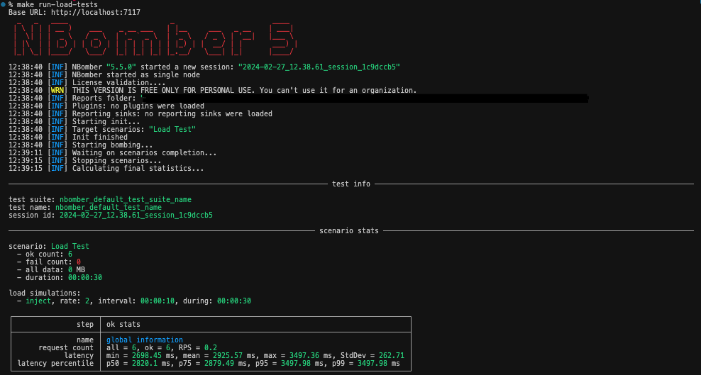

# NBomber Load Tests
This project was created as an example of NBomber usage, a .NET framework that enables Load and Stress testing for a variety of protocols.

The API under the NBomber tests iterates over a list of data files to find the one that matches the ID sent in the NBomber request.

The project is configured to be executed locally, and there is the configuration to run using Docker, taking advantage of the resources management to limit the max of CPUs and Memory so the Application runs in a more controlled environment and the test results are more accurate.

## Requirements:
- [.NET SDK](https://dotnet.microsoft.com/en-us/download)
- [Docker](https://www.docker.com/products/docker-desktop/)

## How to Run:
### Docker:
Execute the following command, this command will build the whole project, create a container with the API, and then another container responsible for running the Load Test.
```sh
make docker-test-load
```
### Local:
You will need to run two commands, in two different terminals.
```sh
# Start the WebApi application:
make run
# Start the Load tests execution:
make run-load-tests
```
## Output / Report:
NBomber will provided two different reports.
1. Console:  

2. HTML:  


